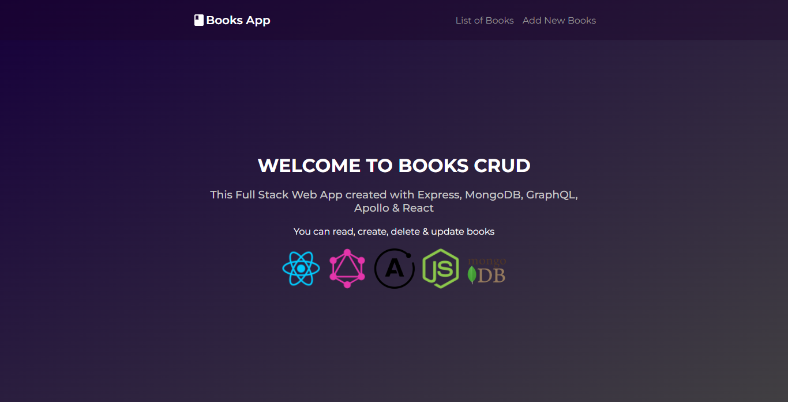
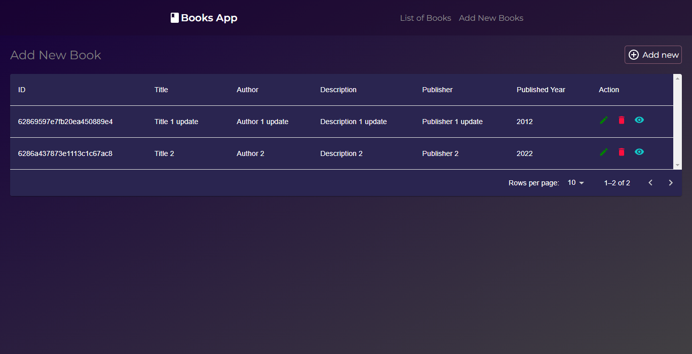
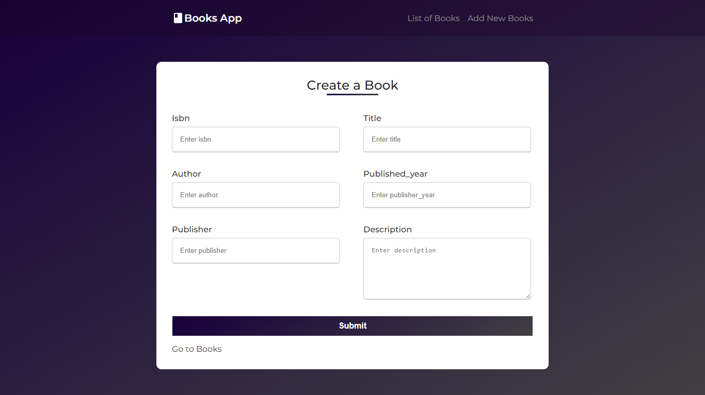

# Book Crud App MERN (Grapqhl Apollo)

Books Web App: You can create, update, delete and read Books

Full Stack App (MongoDb, Express, GraphQL, Apollo & React)

- Using MongoDB to Store Books
- GraphQL provides a complete description of the data in our API, gives us the power to ask for exactly what we need and nothing more.
- Apollo makes us manage both local and remote data with GraphQL. We use it to fetch, cache and modify application data, all while automatically updating your UI.

- ## Home Page

- ## List Books Page

- ## Create Book Form Page

- ## Update Book Form Page

- Hope you like it.
- Follow me on instagram: [@yassinecode]('https://www.instagram.com/yassinecode/')
